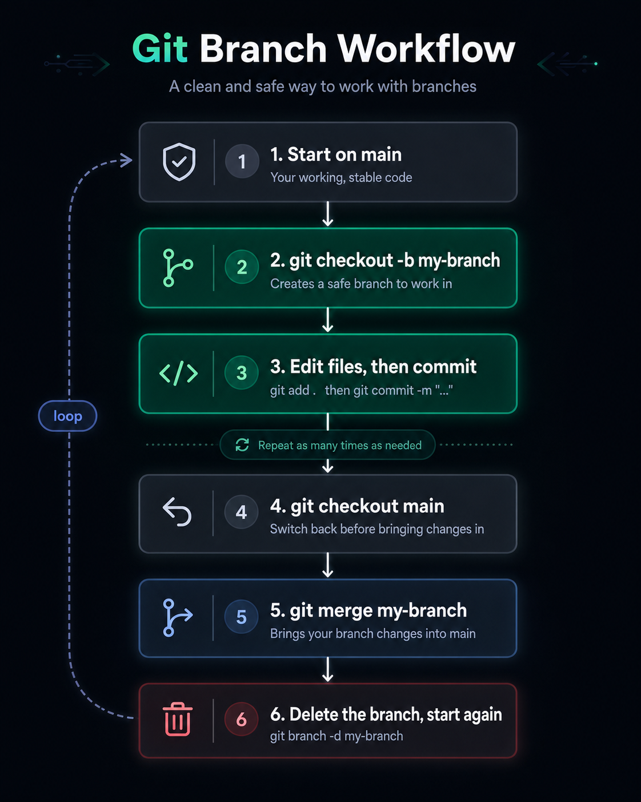

# Git Branching

**Git branching** means creating a separate line of work inside a Git repository.

A branch lets you work on a new feature or fix without changing the main code directly.

```text id="a3b7k2"
main branch     → stable code
feature branch  → new work
bugfix branch   → fix a problem
```

## Why Do We Need Branches?

Without branches, everyone works directly on `main`.

That is risky because broken code can affect the stable project.

With branches, you can safely work on changes, test them, and then merge them into `main`.

```text id="z8r1m9"
main
 │
 ├── feature-login
 ├── bugfix-navbar
 └── update-readme
```

## Git Branch Workflow

The following image shows a simple Git branching workflow:



## Main Branch

The `main` branch usually contains the stable version of the project.

Check current branch:

```bash id="q1z7ms"
git branch
```

The current branch has `*` beside it:

```text id="f8p2na"
* main
```

## Create a New Branch

Create a branch:

```bash id="n2x5jh"
git branch feature-login
```

Switch to it:

```bash id="r6b3tx"
git switch feature-login
```

Or create and switch in one command:

```bash id="k7m9ba"
git switch -c feature-login
```

## Work on the Branch

Make changes, then check status:

```bash id="r3u8p4"
git status
```

Add files:

```bash id="k2v6tz"
git add .
```

Commit changes:

```bash id="d9p4la"
git commit -m "add login feature"
```

## Push the Branch to GitHub

```bash id="o2k8qv"
git push -u origin feature-login
```

This uploads the branch to GitHub.

After that, you can open a Pull Request.

## Merge a Branch

First, go back to `main`:

```bash id="f9c5rb"
git switch main
```

Pull latest changes:

```bash id="cz8n1p"
git pull
```

Merge the branch:

```bash id="c5h9xw"
git merge feature-login
```

## Delete a Branch

After merging, delete the local branch:

```bash id="x1h8vp"
git branch -d feature-login
```

Delete the remote branch from GitHub:

```bash id="gw3wuz"
git push origin --delete feature-login
```

## Common Branch Commands

View local branches:

```bash id="r7k0gq"
git branch
```

View all branches:

```bash id="pr6fw9"
git branch -a
```

Create branch:

```bash id="bdq7ae"
git branch branch-name
```

Switch branch:

```bash id="n9q3mk"
git switch branch-name
```

Create and switch:

```bash id="ra8jdx"
git switch -c branch-name
```

Merge branch:

```bash id="b8m0gu"
git merge branch-name
```

Delete branch:

```bash id="l5v4zf"
git branch -d branch-name
```

## Example Workflow

```bash id="c6sjh5"
git switch main
git pull

git switch -c feature-navbar

# edit files

git add .
git commit -m "add navbar"

git push -u origin feature-navbar
```

Then open a Pull Request on GitHub.

After the Pull Request is reviewed and merged:

```bash id="j6rdz5"
git switch main
git pull
git branch -d feature-navbar
```

## Branch Naming Examples

```text id="d6rcq0"
feature/login-page
feature/docker-compose
bugfix/fix-port-error
hotfix/security-patch
docs/update-readme
```

Good branch names explain what the branch is for.

## Summary

```text id="hd94yq"
branch       → Separate line of work
main         → Stable project code
git switch   → Move between branches
git merge    → Combine branch changes
git push     → Upload branch to GitHub
pull request → Review changes before merging
```

> A Git branch lets you work safely without breaking the main project.

