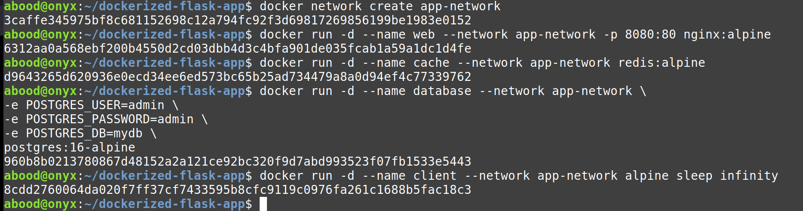
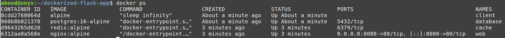

# Docker Networks

A **Docker network** allows containers to communicate with:

* Other containers
* The host machine
* The internet

Containers connected to the same custom network can communicate using container names.

---

## Default Docker Networks

View Docker networks:

```bash
docker network ls
```

Docker provides three default network types:

```text
bridge
host
none
```

### Bridge

Connects containers running on the same Docker host.

```bash
docker run -d --name web nginx
```

A custom bridge network is recommended because containers can communicate using their names.

### Host

Makes the container use the host machine’s network directly.

```bash
docker run --network host nginx
```

### None

Disables external networking for the container.

```bash
docker run --network none nginx
```

---

# Run Four Containers on One Network

```text
app-network
├── web        → Nginx
├── cache      → Redis
├── database   → PostgreSQL
└── client     → Alpine Linux
```

## 1. Create the Network

```bash
docker network create app-network
```

## 2. Run the Containers

### Nginx

```bash
docker run -d \
  --name web \
  --network app-network \
  -p 8080:80 \
  nginx:alpine
```

### Redis

```bash
docker run -d \
  --name cache \
  --network app-network \
  redis:alpine
```

### PostgreSQL

```bash
docker run -d \
  --name database \
  --network app-network \
  -e POSTGRES_USER=abood \
  -e POSTGRES_PASSWORD=123abood \
  -e POSTGRES_DB=mydb \
  postgres:16-alpine
```

### Alpine Client

```bash
docker run -d \
  --name client \
  --network app-network \
  alpine \
  sleep infinity
```

The following screenshot shows the four containers being created and connected to `app-network`:

----------------------------------------------------------------------------

## 3. Check the Containers

```bash
docker ps
```

The following screenshot shows the four running containers:


Inspect the network:

```bash
docker network inspect app-network
```

You should see:

```text
web
cache
database
client
```

---

## 4. Test Communication

Enter the Alpine container:

```bash
docker exec -it client sh
```

Test Nginx:

```bash
wget -qO- http://web
```

Test Redis:

```bash
nc -zv cache 6379
```

Test PostgreSQL:

```bash
nc -zv database 5432
```

Exit:

```bash
exit
```

Docker allows the client to use container names as hostnames:

```text
web       → Nginx
cache     → Redis
database  → PostgreSQL
```

---

## Port Mapping

```bash
-p 8080:80
```

This means:

```text
Host port 8080 → Container port 80
```

Open Nginx:

```text
http://localhost:8080
```

---

## Connect an Existing Container

```bash
docker network connect app-network container-name
```

Disconnect it:

```bash
docker network disconnect app-network container-name
```

---

## Remove the Containers and Network

```bash
docker rm -f web cache database client
docker network rm app-network
```

---

## Summary

```text
bridge          → Connect containers on the same Docker host
host            → Use the host network
none            → Disable networking
custom network  → Communicate using container names
-p              → Publish a container port
```

> Docker networks allow separate containers to communicate securely using container names.

